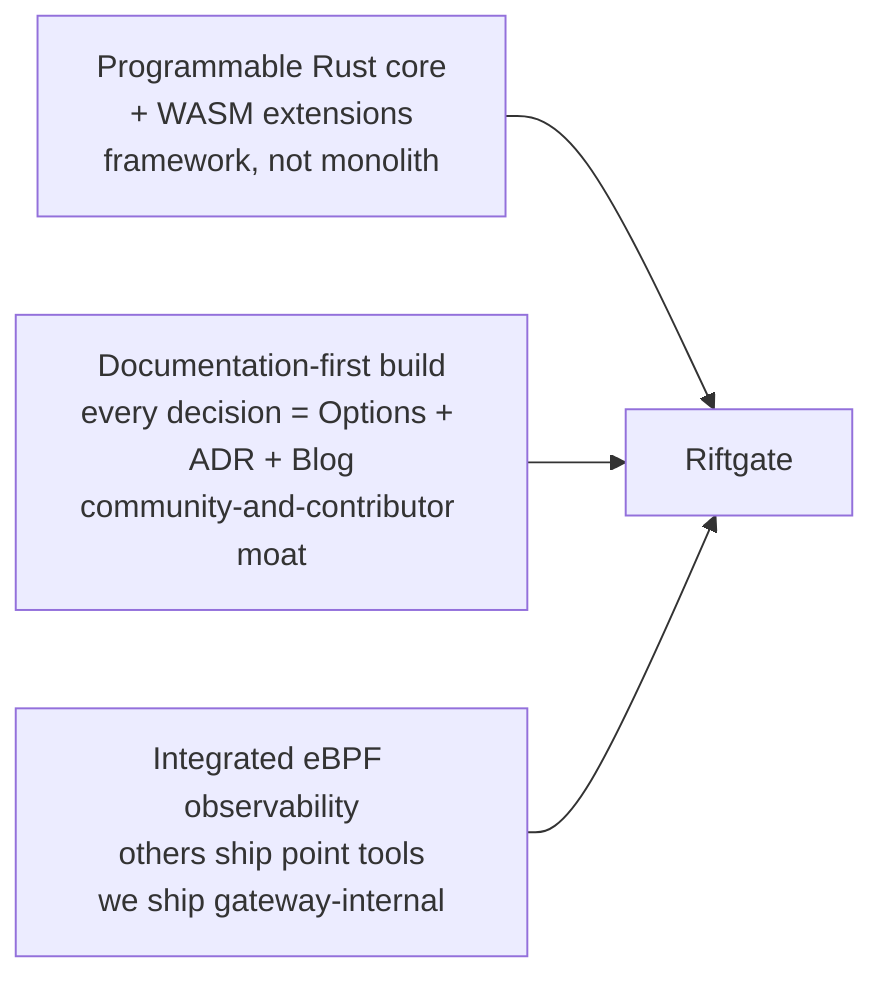

# 00. Vision

> *Riftgate is a programmable AI data plane: a small Rust kernel + WASM extensions, with eBPF-native observability, where every internal decision is documented in public as a teaching artifact for modern systems engineering.*

## 1. Why Riftgate exists

LLM serving is now a serious systems problem and the OSS gateway space has matured rapidly. There is no shortage of capable proxies. There is, however, a shortage of:

- **Pluggable Rust data planes.** Most existing OSS gateways are either Python (LiteLLM, Portkey), Rust monoliths (TensorZero, Helicone, LangDB, Traceloop Hub), or Envoy AI Gateway, which inherits Envoy's C++ weight. None are *small Rust kernels with a documented trait surface that someone can read in an afternoon and extend in a week*.
- **Documented-at-the-decision-level OSS infrastructure.** Almost every serious infrastructure project has a README, a CONTRIBUTING, and a partial design doc. Almost none has 20 numbered Options docs and 20 corresponding ADRs. The discipline is rare because it is unglamorous; the absence is the opportunity.
- **Gateway-internal eBPF observability.** Tools like *LLM eBPF Tracer*, *ProfInfer*, *Ingero*, and *gpu_ext* exist as point profilers. None of them live inside an inference gateway, where the data path can use the signal for adaptive backpressure and where one binary tells one coherent story.

Riftgate exists at the intersection of these three gaps.

## 2. North star (one sentence)

> Build the smallest, most pluggable, most rigorously documented LLM data plane that exists, so that systems engineers and AI infrastructure teams have a substrate they can study, extend, and trust.

## 3. The three differentiation pillars

### 3.1. Programmable Rust core
Every subsystem that matters — IO model, scheduler, allocator, parser, queue, timer subsystem, request log, routing strategy, observability sink, filter chain — is a Rust trait in `riftgate-core` with multiple implementations behind it. Switching impls is a config change or a `cargo` feature flag, not a fork. The default kernel is small enough to read end-to-end in a weekend.

### 3.2. Documentation-first build
Every load-bearing decision ships as a pair:

1. An **Options doc** in [`docs/05-options/`](05-options/) — exhaustive, citation-rich, tradeoff-explicit, written *before* the decision is made.
2. An **ADR** in [`docs/06-adrs/`](06-adrs/) — short, decisive, Michael-Nygard format.

This is not paperwork. It is the **community-and-contributor moat**: people join, study, and extend projects whose internals they can actually read.

### 3.3. Integrated eBPF observability
Riftgate embeds Aya-based BPF programs that:

- Profile the gateway itself continuously (CPU on/off, syscall stalls, NUMA misses, page faults).
- Observe backend GPU saturation via DCGM/NVML correlation.
- Feed adaptive backpressure decisions inside the data path.
- Surface token-level SLOs (TTFT, inter-token latency, jitter) — not just request latency.

The competitors that do this best ship it as a separate sidecar. Riftgate ships it as part of one binary so the signals can drive behavior, not just dashboards.

## 4. Non-goals (what Riftgate explicitly is NOT)

These are stated up front because honest scoping is itself part of the brand. *Imprecise positioning ships as plausible-wrong code.*

- **Not a TensorZero killer.** TensorZero is excellent and has a meaningful head start on raw P99 throughput. We will not promise to beat it. If raw P99 leadership is your only criterion, use TensorZero.
- **Not an Envoy AI Gateway replacement.** Envoy's ecosystem maturity (xDS, control plane, mesh integrations) cannot be matched by a one-person OSS project in 18 months. We do not try.
- **Not a vLLM-class KV-cache router.** Projects like `vllm-router` (Rust!), `kvfleet` (Python), and `llm-d-kv-cache` (Go) already implement vLLM-specific prefix-aware routing with the LMCache controller. We integrate with them via plugins; we do not duplicate them.
- **Not a universal provider translator.** Upstream is OpenAI-compatible only. Anthropic / Google / Bedrock / Cohere payload translation is a filter responsibility, not a kernel feature. Users who need multi-provider translation can place LiteLLM-class tooling in front, or write a WASM adapter filter. Rationale: a universal adapter surface is a full-time project of its own and would dilute Riftgate's systems-substrate focus.
- **Not a globally-coherent rate limiter.** The `RateLimiter` trait is designed to accept a distributed implementation later (Redis / Dragonfly / hash-sharded local+gossip), but `v1.0` ships only an in-proc token-bucket impl. Operators who need cross-replica coherence replicate-the-limit by `N_replicas` or place a proper rate-limit gateway in front.
- **Not a reference semantic cache.** Transparent embedding-based response caching is a known extension point via the `Filter` trait; we do not ship a first-party vector-DB integration before `v1.0`. Users can author a WASM filter that hooks Qdrant / Pinecone / pgvector as they see fit.
- **Not a distributed-state service.** Any shared state across Riftgate replicas (rate-limit counters, session affinity, semantic-cache state) is the operator's responsibility in `v1.0`. The gateway is designed to be horizontally replicable with independent per-instance state.
- **Not yet production-ready.** Not even `v0.1`. Read [`02-mvp-roadmap.md`](02-mvp-roadmap.md) before deploying anything from this repo.
- **Not a Python project, ever.** Rust + WASM is the bet. Python tooling for tests and benchmarks is fine; Python in the data path is not.

## 5. The bet

Performance is table stakes. Pluggability, documentation, and integrated observability are the moats. We are not trying to win the gateway market in 18 months. We are trying to build the substrate that the next generation of AI-infrastructure engineers will read to learn how this layer is supposed to work — and the framework they will reach for when they need to extend it.

If we are right, Riftgate becomes the project that grows because every contributor can find their way in. If we are wrong, we still have a deeply documented Rust codebase that demonstrates fluency with modern systems engineering at distinguished-engineer level — which is its own kind of success.

## 6. Audience

The primary readers and users of Riftgate are:

- **Platform engineers** building LLM infrastructure inside companies, who need a substrate they can audit and extend rather than a black box they have to trust.
- **ML platform / inference SREs** who want gateway-internal eBPF observability and replayable request logs to debug the long tail of LLM serving issues.
- **Systems engineers learning the AI infrastructure layer** for the first time, who want a codebase whose every design decision is documented in public.
- **Contributors** who want to add a routing strategy, a filter, or an observability sink without forking the project.

We are explicitly *not* targeting application developers who want a SaaS multi-provider LLM router. They are well-served by other projects.

## 7. Working norms

- Every commit on `main` is reviewed.
- Every load-bearing change traces back to an ADR.
- Benchmarks are reproducible from this repo or they are not benchmarks.
- War stories in docs and posts are anonymized.
- The [`AGENTS.md`](../AGENTS.md) context harness applies to every agent-assisted change.

## 8. Known extension points / deferred hooks

Riftgate's three pillars are bounded on purpose. The items below are *intentionally* outside the kernel but are named here so contributors and prospective users can see the edges clearly and know where the community can extend us.

- **Semantic caching.** Embedding-based prompt similarity matched against a vector DB. Hook: the `Filter` trait. A reference WASM filter could use Qdrant or Pinecone; we will not maintain one before `v1.0`. The design surface is rich (Bloom filter pre-check to skip misses cheaply, LSH or cosine-similarity against an index, TTL and invalidation strategy) — all interesting, all deferred.
- **Distributed rate limiter.** An impl of the `RateLimiter` trait backed by Redis (`INCR`+TTL, Lua for atomic GCRA), Dragonfly, or a gossip-based sharded counter. Designed-for, not-shipped. Options [`021-rate-limiting`](05-options/021-rate-limiting.md) catalogs the design space.
- **Multi-provider WASM adapter starter library.** Community-maintained WASM filters that translate Anthropic / Google / Bedrock / Cohere payloads to/from the OpenAI-compatible kernel shape. A natural flagship example of the extension plane.
- **Async telemetry pipeline.** Off-hot-path cost accounting and per-tenant billing ledger — Kafka / NATS / Redpanda → ClickHouse. Extends [Options `013`](05-options/013-observability-sink.md) rather than replacing it. Documented as a future impl of the `ObservabilitySink` trait.
- **gRPC / HTTP/2 upstream streaming.** Current framing target is SSE over HTTP/1.1. gRPC-stream is captured in [Options `008`](05-options/008-stream-framing.md) and left as a `v1.0+` deepening.

These are not commitments. They are the honest edges of the kernel's responsibility, documented so that no one has to guess where we draw the line.

