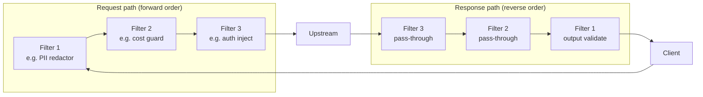
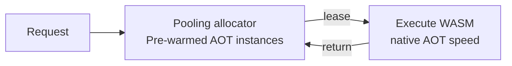
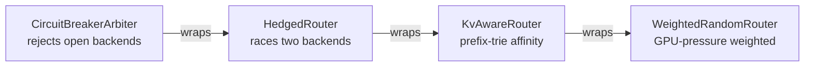
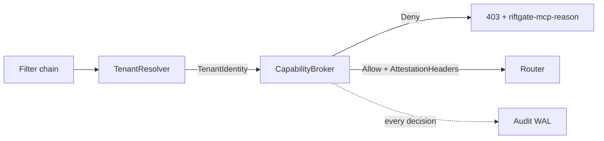

# 03.b Extension Plane

> Pluggable behavior: WASM filters, routing strategies, MCP capability broker, and tenant identity resolver. The extension plane is what makes Riftgate a *framework* rather than a product.
>
> Status: **shipped and production-ready as of v1.0.** All described surfaces are implemented and versioned.

---

## What lives here

| Component | Trait | Shipped | Notes |
|---|---|---|---|
| Filter chain | `Filter` | v0.1 trait; v0.3 executor + WASM | Ordered pipeline; `Terminate` short-circuits |
| WASM runtime | — | v0.3 | wasmtime 31, pooling allocator, AOT precompile |
| Built-in routing strategies | `Router` | v0.1–v0.3 | Round-robin, weighted, KV-aware, hedged |
| GPU-pressure routing | `Router` + `GpuPressureSource` | v0.4 | DCGM/NVML telemetry → weighted backend selection |
| Circuit breaker | `Router` decorator | v0.2 | Three-state; wraps any Router |
| MCP capability broker | `CapabilityBroker` | v0.5 | Per-tenant allowlist + WAL audit + HMAC attestation |
| Tenant identity resolver | `TenantResolver` | v1.0 | API-key registry or trusted-header mode |

---

## 1. Filter chain

### 1.1 Contract (as implemented)

```rust
// crates/riftgate-core/src/filter.rs
pub enum FilterAction {
    Continue,
    Modify(Request),             // or Response; propagates to next filter
    Terminate(StatusCode, Body), // short-circuit; returns immediately to client
}

pub trait Filter: Send + Sync {
    fn on_request(&self, req: &mut Request) -> FilterAction;
    fn on_response(&self, resp: &mut Response) -> FilterAction;
}
```

Filters are ordered. A `Terminate` short-circuits both the rest of the chain and the upstream call. A `Modify` propagates the mutated value to all subsequent filters.

### 1.2 Execution order



Request filters run in **registration order**. Response filters run in **reverse** order.

### 1.3 Native Rust filter

```rust
use riftgate_core::filter::{Filter, FilterAction};

pub struct PromptPrefixFilter { pub prefix: String }

impl Filter for PromptPrefixFilter {
    fn on_request(&self, req: &mut Request) -> FilterAction {
        // prepend system prompt to body JSON
        FilterAction::Continue
    }
    fn on_response(&self, _: &mut Response) -> FilterAction { FilterAction::Continue }
}
```

Wire in `crates/riftgate/src/main.rs` by passing it to `FilterChain::new(vec![...])`.

### 1.4 WASM filter — hands-on walkthrough

WASM filters are loaded at runtime and fully sandboxed. Any language targeting `wasm32-wasip1` works.

**Step 1 — Add the ABI crate**

```toml
# Cargo.toml of your filter crate
[lib]
crate-type = ["cdylib"]

[dependencies]
riftgate-filter-sdk = { git = "https://github.com/sgpopuri/riftgate", tag = "v1.0.0" }
```

**Step 2 — Implement the WIT interface** (`riftgate:filter/v1`)

```rust
use riftgate_filter_sdk::*;

struct MyFilter;
impl Guest for MyFilter {
    fn on_request(ctx: RequestContext) -> FilterAction {
        if let Some(v) = ctx.get_header("x-skip-filter") {
            if v == "true" { return FilterAction::Continue; }
        }
        let body = ctx.get_body();
        ctx.set_body(prepend_system_prompt(body, ctx.get_config("prefix")));
        FilterAction::Continue
    }
    fn on_response(_ctx: ResponseContext) -> FilterAction { FilterAction::Continue }
}
export!(MyFilter);
```

Available host functions: `get-header`, `set-header`, `get-body`, `set-body`, `log`, `get-config`.
Not available (sandbox): filesystem, network, environment variables, spawning threads.

**Step 3 — Compile**

```bash
cargo build --target wasm32-wasip1 --release
# output: target/wasm32-wasip1/release/my_filter.wasm
```

**Step 4 — Register in config**

```toml
[[filter]]
path         = "/etc/riftgate/filters/my_filter.wasm"
capabilities = ["read-body", "write-body", "read-headers", "log"]
[filter.config]
prefix = "You are a helpful assistant."
```

**Step 5 — Verify at startup**

```
INFO riftgate: filter loaded path=…/my_filter.wasm abi="riftgate:filter/v1"
```

If the ABI version is wrong the binary logs `ERROR filter precompile rejected` and exits.

### 1.5 WasmFilter instance pool



wasmtime's pooling allocator pre-warms instances; per-call overhead is a Rust function call + boundary, not a full WASM init. Each instance resets between requests.

### 1.6 Starter filter library

`examples/02-starter-filters/` ships boilerplate for:
- PII redactor (email, phone, SSN patterns)
- Prompt template substitution
- Output schema validator (JSON-mode responses)
- Cost guard (reject if estimated token cost exceeds budget)

---

## 2. Routing strategies

### 2.1 Contract (as implemented)

```rust
// crates/riftgate-core/src/router.rs
pub trait Router: Send + Sync {
    fn route(&self, req: &Request, pool: &BackendPool, signals: &BackendSignals) -> RoutingDecision;
    fn on_response(&self, decision: &RoutingDecision, outcome: &Outcome) {}
}

pub enum RoutingDecision {
    Send(BackendId),
    Hedge(Vec<BackendId>),   // race; first wins; slow side is cancelled
    Reject(StatusCode),
}
```

### 2.2 Decorator stacking (default binary wiring)



`CircuitBreakerArbiter` sits outermost to veto any decision toward an open-circuit backend. Each decorator calls the inner router's `route()` when delegating.

### 2.3 Built-in strategies

| Strategy | Shipped | When to use |
|---|---|---|
| `RoundRobinRouter` | v0.1 | Homogeneous backends, equal load |
| `ConstantRouter` | v0.1 | Testing; always sends to a fixed backend |
| `WeightedRandomRouter` | v0.2 | Heterogeneous capacity or GPU-pressure routing |
| `KvAwareRouter<R>` | v0.3 | Prompt-prefix KV-cache affinity (longest-prefix match via xxHash3-64 trie) |
| `HedgedRouter<R>` | v0.3 | Tail-latency reduction (P2-estimated hedge threshold) |
| `CircuitBreakerArbiter<R>` | v0.2 | Three-state breaker; wraps any inner Router |

### 2.4 Writing a custom Router

```rust
use riftgate_core::router::{BackendPool, BackendSignals, Router, RoutingDecision};
use riftgate_core::request::Request;

pub struct TenantPinnedRouter {
    inner: Arc<dyn Router>,
    premium_backend: BackendId,
}

impl Router for TenantPinnedRouter {
    fn route(&self, req: &Request, pool: &BackendPool, signals: &BackendSignals) -> RoutingDecision {
        if req.headers().get("x-riftgate-tenant").is_some_and(|v| v == "premium") {
            RoutingDecision::Send(self.premium_backend)
        } else {
            self.inner.route(req, pool, signals)
        }
    }
}
```

Wire in `main.rs`:
```rust
let router: Arc<dyn Router> = Arc::new(
    CircuitBreakerArbiter::new(
        TenantPinnedRouter { inner: Arc::new(WeightedRandomRouter::new(&backends)), premium_backend: BackendId(0) },
        CircuitBreakerConfig::default(),
    )
);
```

### 2.5 GPU-pressure signal integration (v0.4)

`WeightedRandomRouter` folds GPU pressure into backend selection automatically.

```bash
RIFTGATE_GPU_DCGM_ENDPOINT=http://dcgm-exporter:9400/metrics ./riftgate --config riftgate.toml
```

The poller updates `BackendSignals` every 5 seconds. No router code changes needed.

---

## 3. MCP capability broker (v0.5)



```toml
[mcp]
enforce  = true
wal_path = "/var/riftgate/mcp-audit"

[mcp.tenants."1"]
allowed_tools             = ["search-web", "read-file"]
denied_tools              = ["filesystem-write"]
allowed_resource_prefixes = ["s3://acme-datasets/*"]
time_bounded_grants       = [{ tool = "send-email", until_unix_secs = 1780000000 }]
```

Set `enforce = false` for dry-run mode: decisions are logged and attested but every request passes through. Use this to calibrate allowlists before enforcement.

---

## 4. Tenant identity resolver (v1.0)

| Impl | Config `mode` | Credential source |
|---|---|---|
| `ApiKeyTenantResolver` | `"api-key"` (default) | `Authorization: Bearer <key>` — SHA-256 hashed against config registry |
| `HeaderTenantResolver` | `"trusted-header"` | `x-riftgate-tenant` header — only safe on trusted internal networks |

```toml
[multitenancy]
mode = "api-key"

[multitenancy.api_keys]
"sha256:e3b0c44298fc1c149afbf4c8996fb924..." = "acme"
```

The resolved `TenantIdentity` flows into the rate limiter (per-tenant token buckets) and the capability broker.

---

## 5. Adding a new extension point

| Goal | What to implement | ADR gate |
|---|---|---|
| New filter | `Filter` trait; register in `FilterChain::new` | No ADR needed |
| New routing strategy | `Router` trait; wire as decorator | No ADR needed |
| New observability sink | `ObservabilitySink` trait; add to `MultiSink` | No ADR if no new external dep |
| New GPU pressure source | `GpuPressureSource` trait; feature-gate on target | Options doc + ADR if new dep |
| New capability broker | `CapabilityBroker` trait; must emit `McpAuditEvent` | New ADR superseding ADR 0015 |
| New tenant resolver | `TenantResolver` trait | New ADR superseding ADR 0029 if externally delegated |

## What lives here

- The filter chain (`Filter` trait + chain executor)
- The WASM runtime (wasmtime)
- The routing strategies (`Router` trait + built-in impls)
- The plugin loader

## Filter contract

A filter sees a typed `Request` or `Response` and returns a `FilterAction`:

```rust
// Sketch
pub enum FilterAction {
    Continue,
    Modify(Request),    // or Response
    Terminate(StatusCode, Body),
}

pub trait Filter: Send + Sync {
    fn on_request(&self, req: &mut Request) -> FilterAction { FilterAction::Continue }
    fn on_response(&self, resp: &mut Response) -> FilterAction { FilterAction::Continue }
    fn on_token(&self, token: &Token) -> FilterAction { FilterAction::Continue }  // streaming
}
```

Filters are ordered. A `Terminate` short-circuits the chain. A `Modify` propagates the modified value to subsequent filters. Filter authors are expected to be cheap and side-effect-free unless explicitly granted capabilities.

## Routing strategy contract

A router sees a `Request` and a `BackendPool`, returns a `RoutingDecision`:

```rust
// Sketch
pub enum RoutingDecision {
    Send(BackendId),
    Hedge(Vec<BackendId>),  // race; first to respond wins
    Reject(StatusCode),
}

pub trait Router: Send + Sync {
    fn route(&self, req: &Request, pool: &BackendPool) -> RoutingDecision;
    fn on_response(&self, _decision: &RoutingDecision, _outcome: &Outcome) {}
}
```

The `on_response` hook lets routers learn (e.g. update circuit-breaker state, evict failing backends).

## WASM filters

Filters can be authored in Rust (or any wasm32-wasip1-targeting language) and loaded at runtime via wasmtime. The host exports a narrow set of capabilities:

- Read/modify request headers and body
- Emit log records with bounded size
- Read configuration values declared in the manifest
- *(Not granted)* host filesystem, network, environment variables

Capability grants are explicit per-filter in config. The default is no capabilities beyond request/response access.

## Starter filter reference set

- **PII redactor** — masks well-known PII patterns (emails, phone numbers, SSNs) from prompts and/or responses.
- **Prompt template substitution** — applies a templated system prompt prefix.
- **Output schema validator** — for JSON-mode responses, validates against a configured schema.
- **Cost guard** — rejects requests whose estimated cost exceeds a per-tenant or per-route budget.

These remain reference examples for the extension plane rather than a claim that each ships as a first-party built-in filter today. The `v0.3` milestone shipped the filter-chain executor, the frozen `riftgate:filter/v1` ABI, and starter boilerplate under `examples/02-starter-filters/`.

## Built-in routing strategies

- **Round-robin** (`v0.1`)
- **Weighted-random** (`v0.2`)
- **KV-cache-aware** (`v0.3`) — integrates with `vllm-router`'s LMCache or uses a built-in prefix trie. See [Options 010](../05-options/010-routing-strategy.md).
- **Hedged requests** (`v0.3`) — race two backends, accept first, cancel slower mid-stream.

## Open design questions

- Should filters be allowed to spawn async work? Default: no, to keep the hot path predictable.
- How do we handle filter ordering conflicts in config? Recommend explicit order with a validation pass at startup.
- Should routing strategies see the WAL for prior decisions? Recommend yes via a read-only view; this enables learning without coupling.
