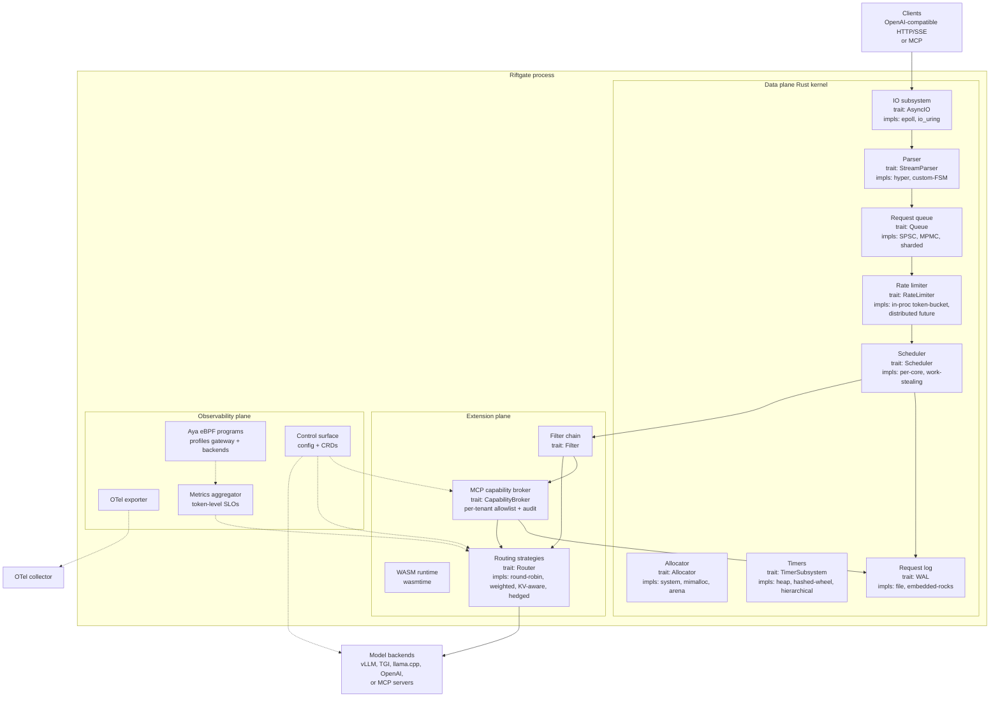
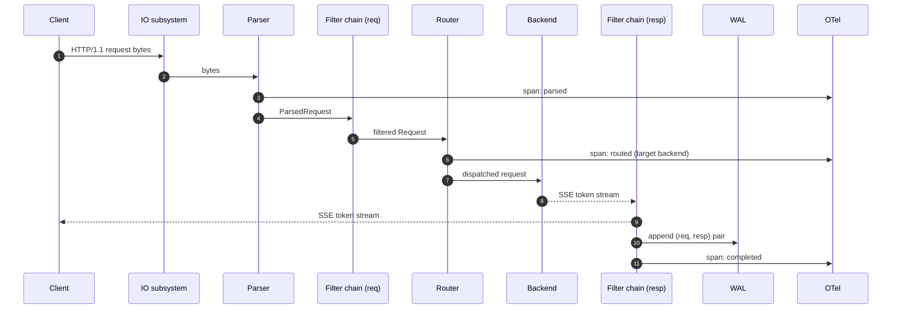
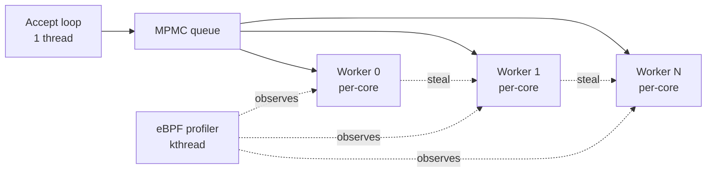
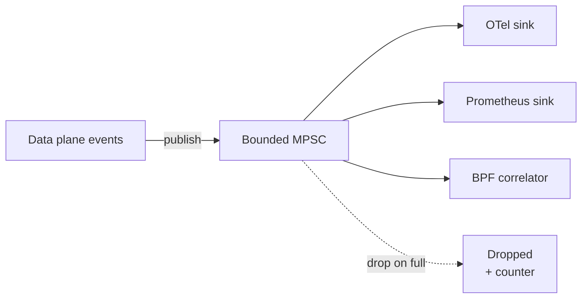

# 03. High-Level Design

> The architecture in one document. Subsystem-level low-level designs live in [`../04-design/`](../04-design/). Decision rationale lives in [`../05-options/`](../05-options/) and [`../06-adrs/`](../06-adrs/).

## 1. The three planes

Riftgate is organized as three planes, each with a clear responsibility and a clear way to extend it:



The three planes communicate through narrow, typed interfaces. Failures in one plane should not silently propagate to another. Plane boundaries are also the natural seams for extension and replacement.

- **[Data plane](data-plane.md)** — the per-request hot path. Receives bytes, parses, schedules, dispatches, frames responses, persists to the request log.
- **[Extension plane](extension-plane.md)** — pluggable behavior: filters (request/response transforms), routing strategies, anything a user wants to inject without forking.
- **[Observability plane](observability-plane.md)** — OTel traces, Prom metrics, eBPF profiles, token-level SLOs.
- **[Control plane](control-plane.md)** — config, CRDs, backend health, hot reloads. Lightest of the four planes by design; production maturity lands in `v1.0`.

## 2. The trait surface

The data plane and extension plane are united by a single trait surface defined in `crates/riftgate-core`:

```rust
// Sketch — actual signatures will live in riftgate-core and may differ
pub trait AsyncIO { /* register fd, await readiness, submit work */ }
pub trait StreamParser { /* incremental, FSM-based; Ch13 */ }
pub trait Scheduler { /* dispatch tasks to workers */ }
pub trait Queue<T> { /* lock-free where possible; Ch4 */ }
pub trait RateLimiter { /* token bucket / leaky bucket / GCRA; v0.2+ */ }
pub trait Allocator { /* arena, slab, system; Ch14 */ }
pub trait TimerSubsystem { /* hierarchical wheels; Ch15 */ }
pub trait WAL { /* append-only, fsync semantics; Ch11 */ }
pub trait Filter { /* request/response transform */ }
pub trait Router { /* select backend(s) for a request */ }
pub trait CapabilityBroker { /* MCP tool/resource authorization; v0.5+ */ }
pub trait ObservabilitySink { /* emit traces, metrics, profiles */ }
```

Every trait must have at least two implementations (a default and an alternative) or a documented reason for one. This is enforced by convention and by the contribution review process.

## 3. Per-request lifecycle



The lifecycle has explicit checkpoints (`parsed`, `routed`, `first-token`, `completed`) so the observability plane can tag spans and the eBPF programs can correlate kernel events with logical phases.

## 4. Concurrency model (default)

By default Riftgate uses a **thread-per-core** model with **lock-free MPMC** queues between accept and worker shards, and **per-core hierarchical timer wheels**. Work-stealing is opt-in for heterogeneous workloads. The reasoning, alternatives, and tradeoffs are in [Options 003 (concurrency model)](../05-options/003-concurrency-model.md) and [Options 004 (request queue)](../05-options/004-request-queue.md).



## 5. Extension contract

Extensions can take three forms:

1. **Native trait impls** linked at compile time. Best for hot-path code where WASM overhead is unacceptable.
2. **WASM filter modules** loaded at runtime. Best for organization-specific transforms (PII, prompt augmentation, output guardrails, multi-provider adapters, semantic caching).
3. **External processors via gRPC** (future, possibly `v1.0`). Best for long-running stateful logic that does not belong in the data plane.

The extension contract is intentionally narrow: filters see a typed `Request` or `Response`, return a `FilterAction` (continue, modify, terminate). Routing strategies see a `Request` and a backend list, return a backend choice or a hedge plan. Nothing in the extension plane has direct access to the IO subsystem or the scheduler — by design.

### 5.1. MCP as the flagship capability example (`v0.5`)

The [Model Context Protocol](https://modelcontextprotocol.io/) is the first MCP-era load-bearing example of the extension plane. The `CapabilityBroker` trait sits between the request-side filter chain and the router: it sees the parsed MCP request (or the MCP-like structure extracted from a tool-use chat message), checks the caller's tenant identity against an allowlist of tools and resources, and either forwards the request with attestation headers or rejects it with a structured denial.

This is distinct from a filter because it has a typed protocol surface (MCP request / response shapes) rather than a generic `Request` / `Response`. A filter can inspect any request; a capability broker understands MCP specifically.

Every capability decision is audited to the WAL (see [`NFR-OBS07`](../01-requirements/non-functional.md)). The goal is that a tenant can later reconstruct every tool a request reached — the gateway as the *capability ledger* for agentic workloads. See [Options `026` (MCP orchestration)](../05-options/026-mcp-orchestration.md) and [`lld-mcp-capability.md`](../04-design/lld-mcp-capability.md).

## 6. Observability contract

Every observability sink consumes typed events from a bounded channel. The data plane never blocks on the observability plane. If the channel fills, observability events are **dropped** (not buffered indefinitely) — backpressure flows the other way.



This pattern is from `Ch5 (ring buffers, drop-on-full logging)` and `Ch8 (backpressure as policy)`.

## 7. Configuration model (default)

Static TOML at startup; environment variables override. Hot reload supported for the safe subset of config (backend additions/removals, route table). Trait-changing config (e.g. swap IO model) requires restart.

CRD-driven configuration via the Kubernetes operator lands in `v1.0`. See [Options 015 (config model)](../05-options/015-config-model.md).

## 8. What is deliberately NOT in the architecture (for now)

- **Distributed control plane** (xDS-style). Out of scope; we leave that to Envoy AI Gateway.
- **Multi-region replication of the request log.** WAL is local to the instance in `v1.x`; cross-region replay is a future possibility.
- **Built-in model serving.** Riftgate is a gateway and data plane, not an inference engine. Backends do the work.
- **Transformative caching.** We do not transparently cache responses. Filters can do this if the user wants it.

## 9. Where to read next

- For the per-request hot path in detail: [`data-plane.md`](data-plane.md)
- For extension and plugin model: [`extension-plane.md`](extension-plane.md)
- For observability and eBPF: [`observability-plane.md`](observability-plane.md)
- For configuration and operator: [`control-plane.md`](control-plane.md)
- For why each subsystem made the choices it did: [`../04-design/`](../04-design/) and [`../05-options/`](../05-options/)
